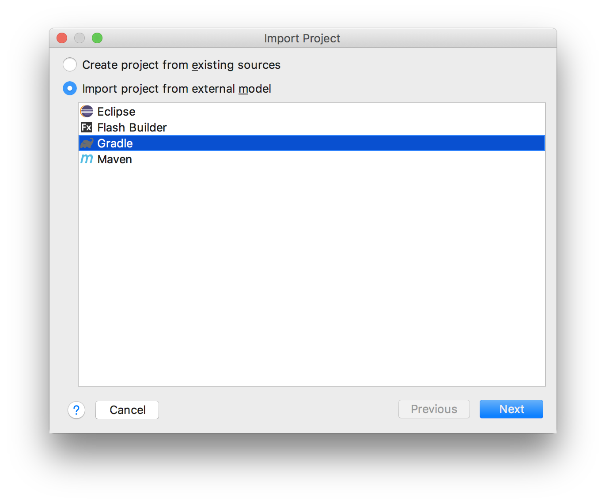
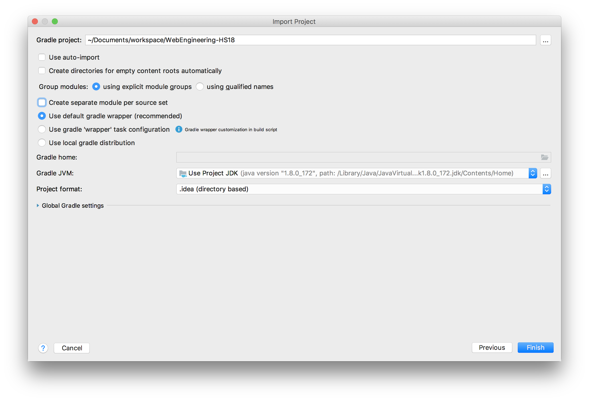

# WebEngineering-HS18

The idea behind it is to avoid any **Grails** installation on target computer. The students just
check out the project and import it into **IntelliJ IDEA**. The IDE takes care of everything.

To import the project, perform the following steps in **IntelliJ IDEA**:

1. _Import Project..._ or _File > New > Project from Existing Sources..._  
1. Select **Gradle** as _external model_:

1. Uncheck _create separate module per source set_:

BTW: 
We created this [Grails](https://grails.org/) project for you by executing the command: `grails create-app mvc` such that **you don't have to create it** yourself, you don't have to install Grails, and we all use the same Grails version.
